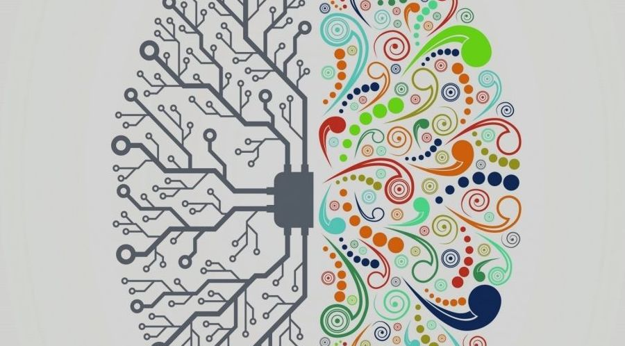

## Ambidextrous Organization

---

## Introduction - Why? - What?

An ambidextrous organization is one that can simultaneously exploit existing competencies while exploring new opportunities.

It is important because it enables organizations to balance the needs of today with the potential of tomorrow.

---

## How its differs?

- Ambidextrous organizations are able to balance the exploitation of existing competencies with the exploration of new opportunities.

- This differs from traditional organizations, which tend to focus on exploiting their existing competencies and may struggle to adapt to new opportunities.

---

### Importance

1. In today's business environment, change is constant and rapid. Organizations that fail to adapt risk becoming irrelevant.

1. Ambidextrous organizations are better equipped to adapt to change and stay relevant.
