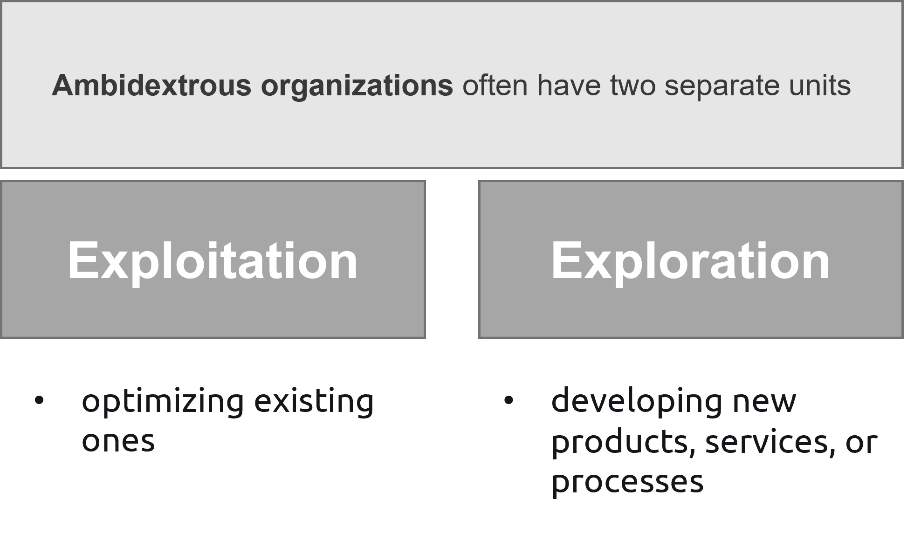

---

# Agenda

1. Explanations
2. Separation of units
3. Structure
4. Difference
5. Pros and cons
6. Examples
7. Conclusion
8. References
9. Q/A

---

### What is it?

An ambidextrous organization is like a person who can use both hands equally well. It can balance two important things:

- Stability: being efficient, reliable, and consistent in delivering products or services that customers love
- Innovation: constantly coming up with new ideas, exploring new opportunities, and being creative in solving problems

---

### What is it?

An ambidextrous organization is one that pursues a growth ambition by separating the people responsible for operating a core business from those that explore into new market areas.

---

### Juggling two priorities

- Many companies focus too much on stability, becoming too rigid and slow
- Other companies focus too much on innovation, becoming too chaotic and unreliable

The ambidextrous organization - balance between these two priorities.

---

## Separation of units

---

## Structure

---

### Difference between Traditional and Ambidextrous organizations

|      Criteria       |             Ambidextrous             |      Traditional       |
| :-----------------: | :----------------------------------: | :--------------------: |
|        Focus        |               Balance                | Primarily focused on 1 |
|      Structure      |               2 units                |         1 unit         |
| Resource Allocation | to both exploitation and exploration |    to exploitation     |

---

|       Criteria        |           Ambidextrous           |                 Traditional                  |
| :-------------------: | :------------------------------: | :------------------------------------------: |
|     Adaptability      |       Agile and responsive       |         Slower to adapt and respond          |
|     Collaboration     |  cross-functional collaboration  |    limited cross-functional collaboration    |
| Competitive Advantage | through innovation and stability | based on existing offerings and efficiencies |

---

### Pros and Cons

---

### Examples

The company has a dedicated unit called “Google X” that focuses on exploring new growth opportunities.
.jpg>)

---

The company has a dedicated unit called “Amazon Web Services” that focuses on exploring new growth opportunities.

---

### Conclusion

- Ambidextrous organizations strike a balance between stability and innovation, enabling them to excel in both operational efficiency and fostering creativity.
- By integrating exploitation (stability-oriented) and exploration (innovation-oriented) units, ambidextrous organizations create a synergistic environment that drives long-term success.
- Ambidextrous organizations adapt to market dynamics, seize opportunities, and stay ahead of the competition while maintaining efficient operations.

---

## References

- F.Dieffenbacher, S. (2023, February 9). Ambidextrous Organization: Examples, Definition, Levels & Benefits. Digital Leadership. https://digitalleadership.com/blog/ambidextrous-organization/
- Organisational ambidexterity | London Business School. (2014, October 1). London Business School. https://www.london.edu/think/organisational-ambidexterity

---

Thank you for your attention!

---
